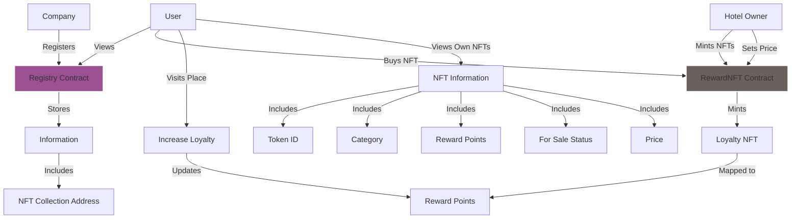

# **NFT Loyalty Program Platform**

## **Demo**

**Demo Link:**

Walrus [https://5ejziylkswo29tqxucpz2oke7lekhhn71frk9rwdoqtvsn423m.walrus.site](https://5ejziylkswo29tqxucpz2oke7lekhhn71frk9rwdoqtvsn423m.walrus.site/)

Vercel(backup) [https://loyal-chain-nu.vercel.app/](https://loyal-chain-nu.vercel.app/)

**Demo Video:** [Walrus](https://aggregator-devnet.walrus.space/v1/nTh9WGmYSTnY2DY3VimeSyTarjW9kV3fZiRbk__as4I), [YouTube](https://www.youtube.com/watch?v=ZCDJQGkLE1E)

## **Overview**

Our platform revolutionizes loyalty programs for cafes, restaurants, and hotels by leveraging NFTs. Businesses can register and issue NFT collections, which users can purchase to earn loyalty points. These points unlock exclusive offers and can be traded for monetary value.

## **Problem Statement**

Traditional loyalty programs are fragmented and often lack transparency and flexibility. Users are forced to manage multiple cards or apps, and the rewards are often limited to specific businesses. Our platform aims to unify these programs into a single, user-friendly system that enhances customer engagement and retention.

## **Solution**

We provide a decentralized platform where:

- **Businesses**: Register and create NFT collections representing their loyalty programs.
- **Users**: Purchase NFTs to earn loyalty points. These points are tied to the NFT token ID in our contract, allowing users to redeem offers or trade their assets.

### **Key Features**

- **Unified Platform**: All participating businesses are listed, making it easy for users to discover new loyalty opportunities.
- **NFT-Based System**: NFTs represent loyalty points, offering transparency and security.
- **Flexible Rewards**: Users can redeem points for offers or trade their NFTs for money.
- **Smart Contracts**: All transactions are securely managed by smart contracts, ensuring fairness and trust.

## Software Architecture

## **Technology Stack**

- **Frontend**: Next.js
- **Blockchain**: Ethereum, Solidity, Sui, Walrus
- **Smart Contracts**: ERC-721 standard for NFTs
- **Deployment**: Walrus

## **How It Works**

1. **Business Registration**: Cafes, restaurants, and hotels register on our platform via contract and create their NFT collections.
2. **User Interaction**: Users browse the platform, purchase NFTs, and earn loyalty points mapped to the NFT token ID.
3. **Redeem & Trade**: Users can redeem points for offers or trade their NFTs on supported marketplaces.

## **Setup Instructions**

1. Clone the repository: `git clone https://github.com/ravish1729/loyal-chain`
2. Install dependencies: `npm install`
3. Start the development server: `npm run dev`
4. Deploy the smart contracts: Follow the instructions in the `https://github.com/ravish1729/loyal-chain/tree/main/web3-link`.

## **Bounty Usage**

1. Smart Contract - [0xf216bc879CFe0893d45CC5bcD1094618ac57e2Af](https://testnet.bscscan.com/address/0xf216bc879CFe0893d45CC5bcD1094618ac57e2Af), [0x4B5Cf880D79360F8f39376d7A456Fe1c3f109EBD](https://testnet.bscscan.com/address/0x4B5Cf880D79360F8f39376d7A456Fe1c3f109EBD), [0xB0d056f88241Cd95a97f60629C2762dfe25b7220](https://testnet.bscscan.com/address/0xB0d056f88241Cd95a97f60629C2762dfe25b7220), [0x398D0e9098b0Eb723d35790C9538899E6348725a](https://testnet.bscscan.com/address/0x398D0e9098b0Eb723d35790C9538899E6348725a), [0xe1Cfa8f693b094793e52990d91825F80FB124De7](https://testnet.bscscan.com/address/0xe1Cfa8f693b094793e52990d91825F80FB124De7)
2. Storage - All Assets are stored in walrus [example](https://aggregator-devnet.walrus.space/v1/up1X4r97OpDEoq71zBDyb7bgVGYYwlKOz7kc27QydqY)

## **Future Enhancements**

- Integration with additional blockchain networks.
- Mobile app development for on-the-go access.
- AI-powered recommendation engine for personalized offers.

## **Contributors**

- [Sanjeev Sharma](https://github.com/thesanjeevsharma)
- [Ravish Sharma](https://github.com/ravish1729)

## **License**

This project is licensed under the MIT License.

## **Contact**

For any inquiries, please contact us at [https://thesanjeevsharma.vercel.app](https://thesanjeevsharma.vercel.app).
